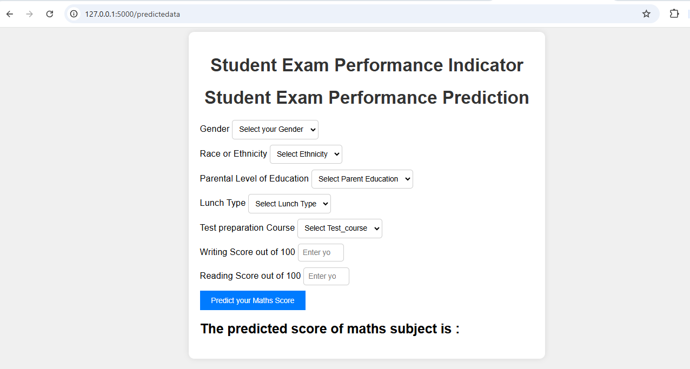
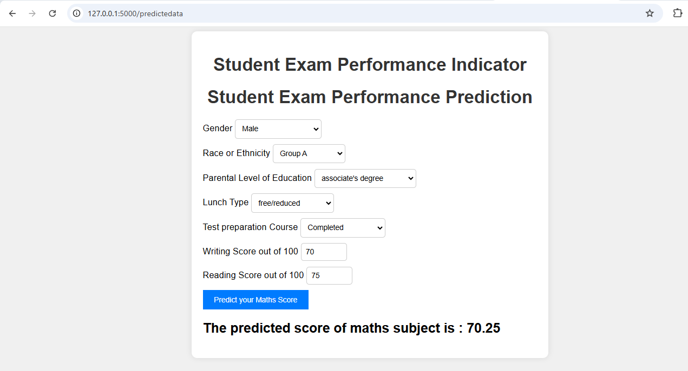

# End to End Machine learning Project

## 🎓 Student Exam Performance Prediction 📊

Predicting student performance based on demographic and preparatory factors using a machine learning model.

**🌟 Project Overview**

This project is a full End-to-End Machine Learning Web Application that predicts a student's math exam score based on inputs like gender, parental education, test preparation, and more. The application provides a seamless interface for users to enter information and receive predictions for academic performance in real-time.

**🗂️ Project Structure**
```bash
project_root/
├── set.py                    # Information about other and project libraries
├── app.py                    # Main Flask application
├── requirements.txt          # Dependencies
├── Dockerfile                # Docker setup for the app
├── src/                      # Core code folder
│   ├── components/           # Data ingestion, transformation, and training
│   ├── pipeline/             # Prediction and training pipelines
│   ├── utils.py              # Utility functions
│   ├── logger.py             # Logging configuration
│   └── exception.py          # Exception handling
├── templates/                # HTML templates
│   ├── index.html
│   └── home.html
├── static/                   # Static files (CSS, JS)
│   └── css/
│       └── styles.css        # Styling for the app
└── config/                   # Configuration files
    ├── __init__.py           # Package initializer
    ├── database_conn.py      # Database connection setup
    └── Insert_data.py        # Function to insert student data into the database
```

**🚀 Features**

* Real-Time Predictions: Input student details to instantly predict their math score.
* Customizable: Easily expandable with additional input features or model enhancements.
* Model Training: Full pipeline for model training, evaluation, and hyperparameter tuning.

**🛠️ Technologies Used**
* Frontend: HTML, CSS (optionally with Tailwind CSS)
* Backend: Flask, Python
* Machine Learning Models:
* Random Forest, Decision Tree, Gradient Boosting, XGBoost, CatBoost, and AdaBoost

**📸 Screenshots**





**📦 Getting Started**

**Prerequisites**
* Install Python >= 3.7
* Install Docker (optional, for containerized deployment)

**Installation**

* 1) Clone the repo:
      git clone https://github.com/Siddhesh2241/student-performance-prediction.git
      cd student-performance-prediction

* 2) Install dependencies:
     pip install -r requirements.txt

* 3) Run the app:
     python app.
     
**🎛️ Model Training and Hyperparameter Tuning**

Run model training with hyperparameter tuning by configuring parameters in train_pipeline.py. This setup uses multiple algorithms (e.g., n_estimators for Random Forest) for optimized performance.
```bash
from sklearn.model_selection import GridSearchCV

param_grid = {
    'RandomForestRegressor': {
        'n_estimators': [100, 200, 300],
        'max_depth': [10, 20, None]
    },
    'XGBRegressor': {
        'learning_rate': [0.01, 0.1, 0.2],
        'n_estimators': [100, 200]
    }
}
```

**🌍 Usage**
* Open your browser and go to http://127.0.0.1:5000.
* Fill in the details like gender, race, parental education, and scores.
* Click on Predict your Maths Score to get an instant result.

**🤖 Future Enhancements**
* Integrate More Models: Add additional advanced machine learning or deep learning models.
* User Authentication: Add user login to save individual progress and predictions.
* Improve UI/UX: Enhance the frontend design with interactive charts or graphs.

**📝 License**
This project is licensed under the MIT License - see the LICENSE file for details.

## 🎉 Thank you for checking out this project! 🎉

**Feel free to open an issue or pull request if you'd like to contribute**.

